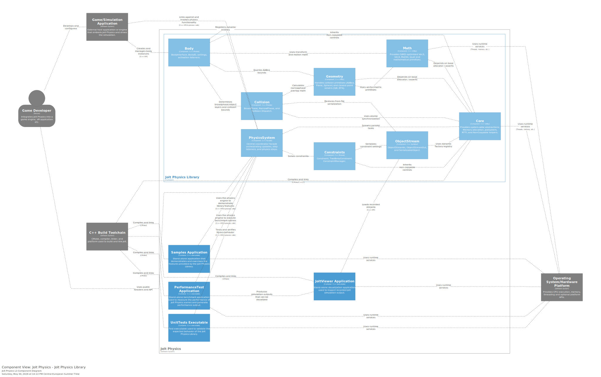
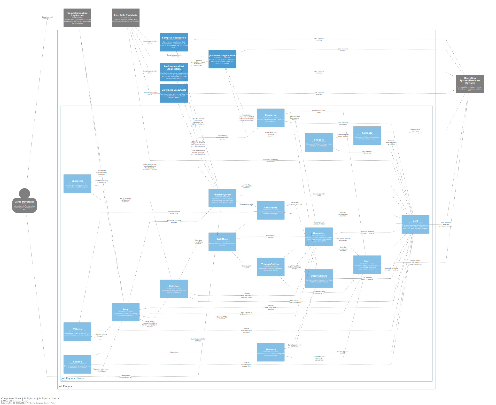
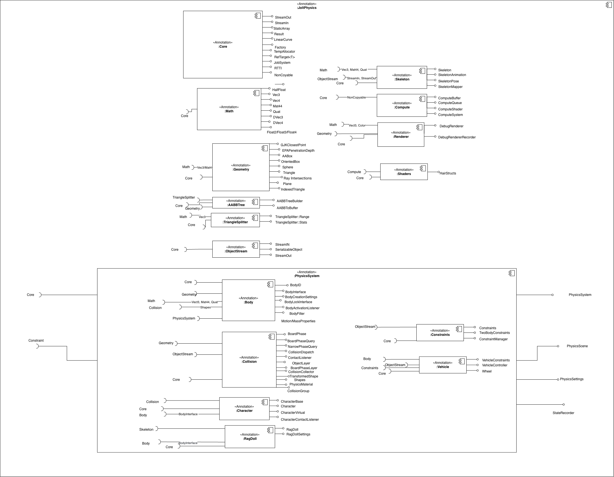

# Architecture

The architecture diagrams are specified using text-based modelling, in particular Structurizr DSL. 

Jolt Physics is primarily a reusable C++ physics engine library. In this analysis the system boundary is placed around the Jolt Physics software system, whose central architectural unit is the Jolt Physics Library. The repository also contains additional executable applications and supporting artifacts.

This distinction is important because not every repository element has the same architectural role. The Jolt Physics Library is the main container delivered for integration into external host applications. Other executable elements are included in the container diagram as supporting containers around the library. Although they are not required by a game or simulation application at runtime, they are relevant to the repository architecture because they demonstrate, test, benchmark and visualize the behavior of the library.

## Context level
At the context level, Jolt Physics is modeled as a software system used by game, simulation or VR developers. These developers interact with Jolt mainly through its public C++ API, documentation, examples and build configuration. The final users of applications using Jolt, such as players, are not represented as direct actors in this diagram because they do not interact with Jolt Physics directly. They interact with a game/simulator/engine that internally embeds the library. For this reason, the direct external software system is represented as a Game Application, which links against Jolt and invokes its physics functionality through in-process C++ calls.

The context diagram also includes the C++ build toolchain and the operating system/hardware platform. The build toolchain is relevant because Jolt is a compiled C++ library and must be built and linked using tools such as CMake, a compiler, linker, etc. . The operating system and hardware platform are relevant because a physics engine depends on runtime services such as memory allocation, multithreading, CPU execution etc. . 

## Container level
At the container level, the system is modeled around the core deployable container: the Jolt Physics Library, plus a small set of supporting stand-alone executable containers provided by the repository.

The internal folders under `Jolt/` aren't represented as containers; they are important architectural areas, but they're not independently deployable runtime units.

The repository-level folders outside the core library, such as `Samples/`, `UnitTests/`, `PerformanceTest/`, and `JoltViewer/`, are modeled as containers of the Jolt Physics system. They may be compiled as separate executables, but they are support artifacts around the library rather than runtime required parts of the library. They were included in the system boundary chosen for this architecture analysis for the sake of completeness since they help test or visualize Jolt.

Jolt Physics is not a multi-container service-based system. Its core architectural unit is a monolithic native library designed to be embedded inside external applications, while the additional executable containers support development, testing, performance analysis, and visualization. The main architectural complexity is therefore still concentrated inside the Jolt Physics Library rather than in interactions between distributed runtime containers.

### Relationship with the Clean Architecture blueprint
At container level, Jolt Physics shows little direct correspondence with the Clean Architecture blueprint. Clean Architecture is mainly useful when a system can be decomposed into application layers with clear dependency rules, such as domain logic, use cases, interface adapters and external frameworks. JoltPhysics, instead, is a performance-oriented C++ engine library surrounded by supporting executable containers.

However, one important Clean Architectur eprinciple is still present: dependencies point toward the central, reusable core. This was verified with an "include-level" dependency analysis. The `Samples`, `JoltViewer`, `PerformanceTest`, `UnitTests` containers depnd on the Jolt Physics Library, while no include dependency is visible from the library to those supporting containers.

Therefore, the relationship with Clean Architecture is only partial and conceptual. The architecture isn't a Clean Architecture system, because it doesn't implement the typical layers of the blueprint. Nevertheless, its container-level dependency direction respects a similar separation principle.

## Component Diagram
### Component Diagram (C4 Level 3):

### Detailed Component Interactions:

### UML Component Diagram:

### Explanations:
 JoltPhysics is divided into two layers. The top layer holds reusable utility components (Core, Math, Geometry, AABBTree, TriangleSplitter, ObjectStream, Skeleton, Renderer, Shaders, Compute). The bottom layer is the PhysicsSystem subsystem containing the main simulation components (Body, Collision, Character, RagDoll, Shapes, Constraints, Vehicle, SoftBody, Hair).

### SOLID Violations:

Single Responsibility Principle

| # | Class | File | Issue | 
|---|---|---|---|
| 1 | `PhysicsSystem` | `PhysicsSystem.h` | 6 responsibilities: simulation, body access, collision, serialization, listeners, internal systems. This one class controls the entire physics world  it runs the simulation, manages bodies, handles collision, saves/loads state, listens for events, and manages internal subsystems. If you want to change how saving works, you risk breaking the simulation.  |
| 2 | `DebugRenderer` | `DebugRenderer.h` | Primitive drawing + GPU batch creation + LOD management.This class draws debug shapes on screen, but it also decides how to batch draw calls for the GPU and manages level-of-detail (how detailed shapes look at different distances). Drawing is one job. Batching is another. LOD is a third. |
| 3 | `Shape` | `Shape/Shape.h` | Collision + geometry + mass + debug + serialization + sub-shape. A shape class should describe a shape. But this class also detects collisions, calculates mass, draws debug visualizations, saves itself to disk, and manages child shapes. Any change to how shapes are saved affects the same class as how shapes detect collisions which makes both harder to change safely. |
| 4 | `CharacterVirtual` | `CharacterVirtual.h` | Movement + contacts + penetration + ground detection + predictive contact. This class moves a character, but it also records every contact point the character touches, resolves penetration (when the character clips into a wall), detects what ground the character is standing on, and predicts future contacts before they happen. Five different jobs in one class. |
| 5 | `RagdollSettings` | `Ragdoll.h` | Config + skeleton mapping + serialization + stabilization.  A settings class should just hold configuration values. But this class also maps the ragdoll onto a skeleton (a separate concern), saves and loads itself (serialization), and contains logic to stabilize the ragdoll simulation. Four reasons to change it.|

Open/Closed Principle

| # | Class | File | Issue |
|---|---|---|---|
| 1 | `CollisionDispatch` | `CollisionDispatch.h` | For new shape type manual registration is required. When you create a new shape (say a cone), you must manually go into CollisionDispatch and register how the cone collides with every other shape. This is editing existing code to add new behaviour. |
| 2 | `EShapeSubType` | `Shape.h` | For new shape we have to enum modify so full recompile. EShapeSubType is a list (enum) of all shape types. Adding a new shape means adding a new entry to this list, which forces every file that uses the list to recompile. In a large codebase, this can mean recompiling thousands of files just to add one shape. |
| 3 | `PhysicsSystem` | `PhysicsSystem.h` | `BroadPhaseQuadTree` concrete member, not swappable. The broadphase is the system that quickly filters which objects might be colliding. PhysicsSystem hardcodes it as BroadPhaseQuadTree. If you want to try a different broadphase algorithm (say a grid or a BVH tree), you must modify PhysicsSystem itself.|

Liskov Substitution Principle

| # | Class | File | Issue |
|---|---|---|---|
| 1 | `CharacterVirtual` | `CharacterVirtual.h` | `GetBodyID()` always returns invalid, no body exists. CharacterVirtual inherits from CharacterBase. CharacterBase has a method GetBodyID() that promises to return the physics body attached to the character. But CharacterVirtual has no physics body it moves kinematically so GetBodyID() always returns an invalid ID. Any code that calls GetBodyID() on a CharacterBase pointer and then uses the result will silently fail if it receives a CharacterVirtual |
| 2 | `PlaneShape` | `PlaneShape.h` | Infinite bounds + zero mass, parent contract broken.Shape promises that every shape has finite bounds (a bounding box) and a meaningful mass. PlaneShape represents an infinite flat plane — its bounds are infinite and its mass is zero. Code that calculates physics based on a shape's mass or bounding box will break silently when given a PlaneShape |
| 3 | `EmptyShape` | `EmptyShape.h` | All collision methods no-op, caller gets nothing. EmptyShape inherits from Shape and is supposed to be a shape that participates in collision. But every collision method does absolutely nothing. A caller that asks "did this shape collide with anything?" will always get no results.|

Interface Segregation Principle

| # | Class | File | Issue |
|---|---|---|---|
| 1 | `Shape` | `Shape.h` | 6 concern groups in one interface. The Shape interface forces any class that implements it to provide methods for collision detection, geometry queries, mass calculation, debug rendering, serialization, and sub-shape access all six groups at once. A class that only needs to render a shape for debug purposes is still forced to implement collision detection methods it will never use. |
| 2 | `BodyInterface` | `BodyInterface.h` | 7 concern groups: creation, transform, velocity, forces, activation, query, material. BodyInterface is the main way to interact with physics bodies. It bundles together: creating bodies, moving them, setting velocity, applying forces, activating/deactivating, querying their position, and getting their material. A system that only needs to query positions must still depend on the full interface including force application methods it will never call. |
| 3 | `CharacterBase` | `CharacterBase.h` | `GetBodyID()` forced on `CharacterVirtual` which has no body. CharacterBase is the shared interface for all character types. It includes GetBodyID() — but CharacterVirtual has no body. By putting this method in the base interface, all character implementations are forced to provide it even when it makes no sense for them. CharacterVirtual has to implement a method that returns an invalid ID just to satisfy the interface. |
| 4 | `BroadPhase` | `BroadPhase.h` | Body management + queries + optimization + layer collision. BroadPhase combines four separate concerns in one interface: adding/removing bodies, running spatial queries, optimising the internal tree structure, and configuring layer collision rules. A system that only wants to run spatial queries must depend on the full interface including body management and optimisation methods it will never call. |

Dependency Inversion Principle

| # | Class | File | Issue |
|---|---|---|---|
| 1 | `RagdollSettings` | `Ragdoll.h` | Concrete `Skeleton*`,no `ISkeleton` interface. RagdollSettings stores a direct pointer to a Skeleton object. There is no ISkeleton interface. This means RagdollSettings is hard-wired to one specific implementation of a skeleton. If you wanted to use a different skeleton representation (say from a different animation system), you would have to change RagdollSettings itself. |
| 2 | `PhysicsSystem` | `PhysicsSystem.h` | `BroadPhaseQuadTree` hardcoded member, not injectable. PhysicsSystem creates and owns a BroadPhaseQuadTree directly. There is no way to pass in a different broadphase from outside (called "dependency injection"). This makes it impossible to test PhysicsSystem with a fake or mock broadphase, and impossible to swap the algorithm without modifying the class. |
| 3 | `Hair` | `Hair/` internals | Concrete `SoftBodySharedSettings`,  no abstraction. The Hair simulation internally depends directly on SoftBodySharedSettings — the concrete settings class for soft bodies. There is no abstract ISoftBodySettings interface. If the soft body settings structure ever changes, Hair must change too, even if Hair's own behaviour has not changed.|
| 4 | `ContactConstraintManager` | `ContactConstraintManager.h` | Concrete `Body&`,  no `IBody` abstraction. ContactConstraintManager takes direct references to Body objects the concrete physics body class. There is no IBody interface. This means the constraint manager is tightly coupled to the full Body implementation. You cannot test the constraint manager with a lightweight mock body; you must set up a real Body with all its dependencies.|

## Architectural level
### 1. Performance Efficiency

- **JobSystem (Core)** — Uses multiple CPU threads so work runs in parallel. 
- **TempAllocator (Core)** — Uses a fast stack-based memory system instead of slow heap allocations. Memory is cleared each frame, avoiding performance costs.  
- **Math system** — Uses SIMD (vector processing) so multiple calculations run at the same time.  
- **SoftBody optimization** — Data is pre-sorted before simulation to improve cache performance.  
- **GPU compute** — Heavy work can be moved to the GPU when available (DirectX 12, Metal, Vulkan).  

### 2. Functional Suitability

- **Rigid bodies (:Body)** — Provides complete dynamics with MotionProperties, MassProperties, and activation management.  
- **Collision detection** — Includes broad-phase (BroadPhase, BroadPhaseQuery) and narrow-phase (NarrowPhaseQuery, CollisionDispatch).  
  Shapes module provides 12+ shape types covering all standard collision geometries.  
- **Constraints (:Constraints)** — Covers all standard joint types: FixedConstraint, HingeConstraint, SliderConstraint, PointConstraint, ConeConstraint, SwingTwistConstraint, SixDOFConstraint, PathConstraint, GearConstraint, RackAndPinionConstraint, PulleyConstraint.  
- **Specialised simulation** — Components like :Vehicle, :Character, :SoftBody, :Ragdoll, :Hair demonstrate completeness beyond basic rigid body dynamics.  

### 3. Compatibility

- **Renderer / Compute** — Supports multiple graphics APIs: DirectX 12, Metal, Vulkan. The engine co-exists with all major graphics pipelines without modification.  
- **ApplicationWindow** — Separate implementations for Linux, macOS, and Windows ensure cross-platform support.  
- **SkeletonMapper** — Maps between different bone hierarchies, allowing interoperability with external animation systems using different skeleton conventions.  

### 4. Reliability

- **IslandBuilder** — Isolates independent body groups. Instability in one simulation island does not affect others, ensuring fault isolation.  
- **Floating-point control** — FPExceptionDisableDivByZero, FPExceptionDisableInvalid, FPExceptionDisableOverflow are explicitly handled to prevent NaN propagation and simulation corruption.  
- **MutexArray (BodyManager)** — Provides fine-grained per-body locking, preventing race conditions in multi-threaded environments.  

### 5. Flexibility

- **TempAllocator variants** — TempAllocatorImpl, TempAllocatorImplWithMallocFallback, TempAllocatorMalloc allow different memory strategies depending on platform or configuration.  
- **VehicleController abstraction** — Enables new vehicle types without modifying core logic. Includes WheeledVehicleController, TrackedVehicleController, MotorcycleController.  
- **EShapeSubType** — Reserves User1–User4 slots for custom shape extensions.  
- **Compute backend** — GPU compute is optional. If unavailable, system falls back to CPU automatically, supporting both mobile and high-end systems.  

### 6. Maintainability

- Layered architecture ensures Core, Math, and Geometry have zero dependencies on Physics components. Changes in Physics do not propagate downward.  
- **:Math and :Core stability index = 0.0** — These are highly stable foundational modules.  
- **ObjectStream reuse** — Shared across Shapes, Skeleton, Ragdoll, PhysicsScene, and Constraints, reducing duplication and improving maintainability.  