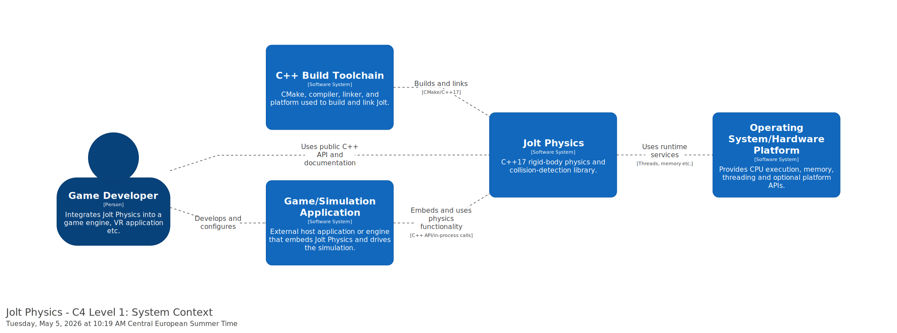
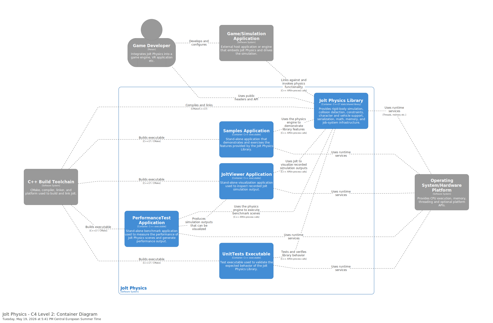

# Architecture

Tool used: structurizr

## Context level
explanations need to be added

## Container level
explanations\relationship with the Clean Architecture blueprint need to be added

## Component level
*Component level: diagrams and explanations. \
Did you observe any violation of SOLID principles at level 3 ?*

## Architectural level
*Architectural characteristics: comment on important architectural characteristics/qualities of the system and how they are supported by the architecture. \
You might also use components coupling and cohesion metrics to support your reasoning.*