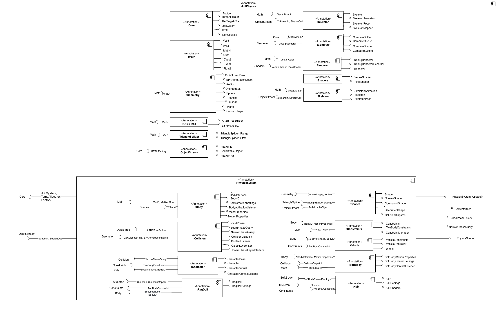

# Architecture

The architecture diagrams are specified using text-based modelling, in particular Structurizr DSL (see c4.dsl file). 

Jolt Physics is primarily a reusable C++ physics engine library. In this analysis the system boundary is placed around the Jolt Physics software system, whose central architectural unit is the Jolt Physics Library. The repository also contains additional executable applications and supporting artifacts.

This distinction is important because not every repository element has the same architectural role. The Jolt Physics Library is the main container delivered for integration into external host applications. Other executable elements are included in the container diagram as supporting containers around the library although they are not required by a game or simulation application at runtime, but they are relevant to the repository architecture because they demonstrate, test, benchmark, and visualize the behavior of the library.

## Context level
At the context level, Jolt Physics is modeled as a software system used by game, simulation, or VR developers. These developers interact with Jolt mainly through its public C++ API, documentation, examples, and build configuration. The final users of applications using Jolt, such as players, are not represented as direct actors in this diagram because they do not interact with Jolt Physics directly. They interact with a game/simulator/engine that internally embeds the library. For this reason, the direct external software system is represented as a Game Application, which links against Jolt and invokes its physics functionality through in-process C++ calls.

The context diagram also includes the C++ build toolchain and the operating system/hardware platform. The build toolchain is relevant because Jolt is a compiled C++ library and must be built and linked using tools such as CMake, a compiler, linker, etc. . The operating system and hardware platform are relevant because a physics engine depends on runtime services such as memory allocation, multithreading, CPU execution etc. . 

## Container level
At the container level, the system is modeled around the core deployable container: the Jolt Physics Library, plus a small set of supporting stand-alone executable containers provided by the repository.

The internal folders under `Jolt/` aren't represented as containers; they are important architectural areas, but they're not independently deployable runtime units. They are compiled together into the same library and cooperate through C++ headers, classes, functions, templates, and shared internal abstractions.

The repository-level folders outside the core library, such as `Samples/`, `UnitTests/`, `PerformanceTest/`, and `JoltViewer/`, are modeled as containers of the Jolt Physics system. They may be compiled as separate executables, but they are support artifacts around the library rather than runtime required parts of the libray, but they were included in the system boundary chosen for this architecture analysis for the sake of completeness since they help test or visualize Jolt.

Jolt Physics is not a multi-container service-based system. Its core architectural unit is a monolithic native library designed to be embedded inside external applications, while the additional executable containers support development, testing, performance analysis, and visualization. The main architectural complexity is therefore still concentrated inside the Jolt Physics Library rather than in interactions between distributed runtime containers.

### Relationship with the Clean Architecture blueprint
At container level, Jolt Physics shows little direct At container level, Jolt Physics shows little direct correspondence with the Clean Architecture blueprint. Clean Architecture is mainly useful when a system can be decomposed into application layers with clear dependency rules, such as domain logic, use cases, interface adapters and external frameworks. JoltPhysics, instead, is a performance-oriented C++ engine library surrounded by supporting executable containers.

A limited separation of concerns is still visible inside the core library. Physics functionalities are mainly grouped under `Jolt/Physics`, infrastructure facilities under `Jolt/Core`, serialization under `Jolt/ObjectStream`, and compute backends under `Jolt/Compute`. However, this is a modular organization inside one native library, not a Clean Architecture layering. The additional executable containers depend on the library but do not introduce Clean Architecture layers; they mainly exercise, validate, measure, or help visualize the library. 

Therefore, the relationship with Clean Architecture is only partial and conceptual. The architecture is better described as a modular, performance-oriented library architecture with supporting executables rather than a Clean Architecture implementation. 

## Component Diagram

### Explanations:
 JoltPhysics is divided into two layers. The top layer holds reusable utility components (Core, Math, Geometry, AABBTree, TriangleSplitter, ObjectStream, Skeleton, Renderer, Shaders, Compute). The bottom layer is the PhysicsSystem subsystem containing the main simulation components (Body, Collision, Character, RagDoll, Shapes, Constraints, Vehicle, SoftBody, Hair).

### SOLID Violations:

Single Responsibility Principle

| # | Class | File | Issue |
|---|---|---|---|
| 1 | `PhysicsSystem` | `PhysicsSystem.h` | 6 responsibilities: simulation, body access, collision, serialization, listeners, internal systems |
| 2 | `DebugRenderer` | `DebugRenderer.h` | Primitive drawing + GPU batch creation + LOD management |
| 3 | `Shape` | `Shape/Shape.h` | Collision + geometry + mass + debug + serialization + sub-shape |
| 4 | `CharacterVirtual` | `CharacterVirtual.h` | Movement + contacts + penetration + ground detection + predictive contact |
| 5 | `RagdollSettings` | `Ragdoll.h` | Config + skeleton mapping + serialization + stabilization |

---

Open/Closed Principle

| # | Class | File | Issue |
|---|---|---|---|
| 1 | `CollisionDispatch` | `CollisionDispatch.h` | For new shape type manual registration is required |
| 2 | `EShapeSubType` | `Shape.h` | For new shape we have to enum modify so full recompile |
| 3 | `PhysicsSystem` | `PhysicsSystem.h` | `BroadPhaseQuadTree` concrete member, not swappable |

---

Liskov Substitution Principle

| # | Class | File | Issue |
|---|---|---|---|
| 1 | `CharacterVirtual` | `CharacterVirtual.h` | `GetBodyID()` always returns invalid, no body exists |
| 2 | `PlaneShape` | `PlaneShape.h` | Infinite bounds + zero mass, parent contract broken |
| 3 | `EmptyShape` | `EmptyShape.h` | All collision methods no-op, caller gets nothing |
| 4 | `StaticCompoundShape` | `StaticCompoundShape.h` | `AddShape()` throws assert, parent promises it works |

---

Interface Segregation Principle

| # | Class | File | Issue |
|---|---|---|---|
| 1 | `Shape` | `Shape.h` | 6 concern groups in one interface |
| 2 | `BodyInterface` | `BodyInterface.h` | 7 concern groups: creation, transform, velocity, forces, activation, query, material |
| 3 | `CharacterBase` | `CharacterBase.h` | `GetBodyID()` forced on `CharacterVirtual` which has no body |
| 4 | `BroadPhase` | `BroadPhase.h` | Body management + queries + optimization + layer collision |

---

Dependency Inversion Principle

| # | Class | File | Issue |
|---|---|---|---|
| 1 | `RagdollSettings` | `Ragdoll.h` | Concrete `Skeleton*`,no `ISkeleton` interface |
| 2 | `PhysicsSystem` | `PhysicsSystem.h` | `BroadPhaseQuadTree` hardcoded member, not injectable |
| 3 | `Hair` | `Hair/` internals | Concrete `SoftBodySharedSettings`,  no abstraction |
| 4 | `ObjectStreamIn` | `ObjectStream.cpp` | `Factory::sInstance` global singleton, not injectable |
| 5 | `DebugRenderer` | `DebugRenderer.h` | `sInstance` global singleton, unit testing impossible |
| 6 | `ContactConstraintManager` | `ContactConstraintManager.h` | Concrete `Body&`,  no `IBody` abstraction |

## Architectural level
*Architectural characteristics: comment on important architectural characteristics/qualities of the system and how they are supported by the architecture. \
You might also use components coupling and cohesion metrics to support your reasoning.*