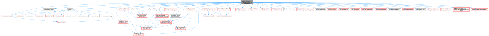
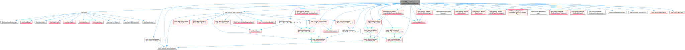
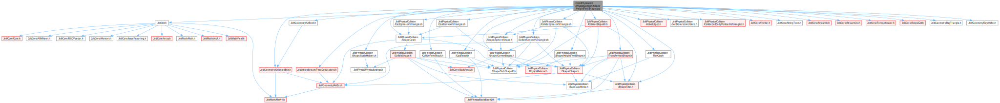
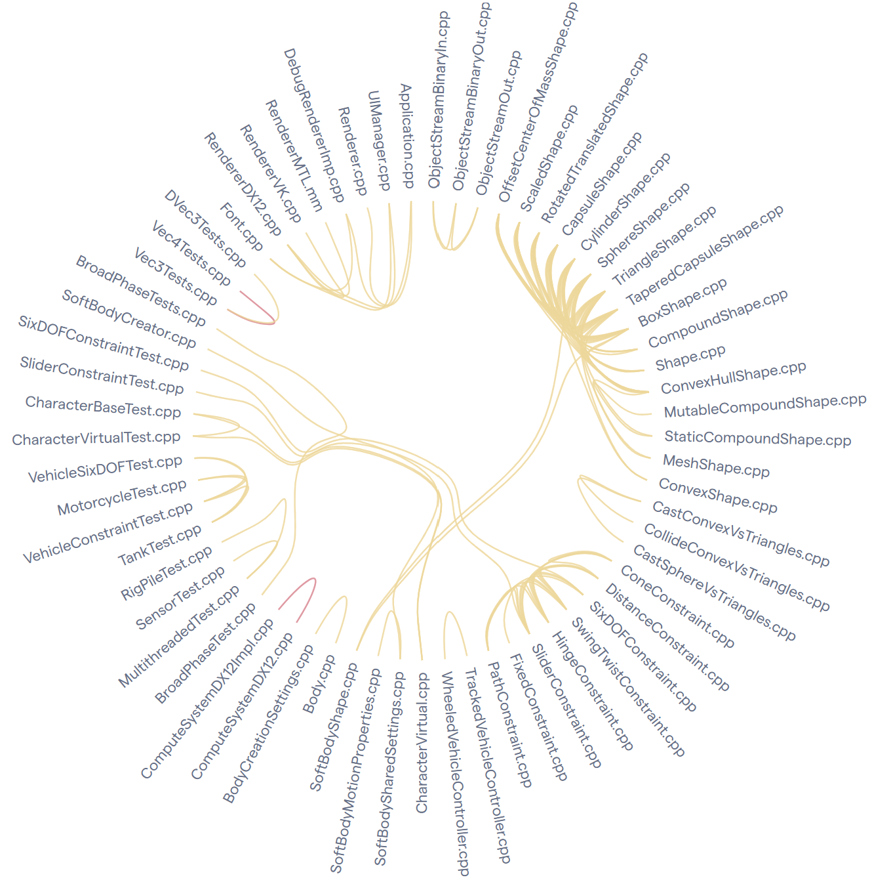

## 1. Dependencies Analysis

### 1.1 Methodology

To evaluate the dependencies among the software modules within the core Jolt Physics library, we employed this approach:

1. **Code Dependencies (Static Analysis):** We utilized **Doxygen** in conjunction with **Graphviz (Dot)** to parse the source code and extract structural dependencies. We configured Doxygen to recursively scan the directory and generate inclusion and inverse-inclusion graphs (with a maximum graph depth of 3). This allowed us to map afferent (incoming) and efferent (outgoing) coupling visually.
2. **Knowledge Dependencies (Behavioral Analysis):** To assess co-change frequencies (temporal coupling), we utilized **CodeScene**. By analyzing the Git commit history of the repository, we identified sets of files that are frequently modified together within the same commit. This approach allowed us to uncover implicit logical or architectural coupling between modules that might not be visible through traditional static analysis.

### 1.2 Code Dependencies Results 

#### Files with the Most Dependencies
The files exhibiting the highest number of outgoing dependencies are central implementation files (`.cpp`) that act as orchestrators or manage complex geometry and simulation logic:

* **`MeshShape.cpp` (36 dependencies):** This file handles complex mesh-based collision detection. Its high dependency count is justified by the need to interact with bounding volume hierarchies (BVH), triangle intersection algorithms, and various collision interfaces.

* **`PhysicsSystem.cpp` (31 dependencies):** This is the core orchestrator of the JoltPhysics engine. It coordinates bodies, constraints, shapes, and the simulation steps. Its high coupling is a natural consequence of its role as the central "hub" or Facade of the engine.

* **`HeightFieldShape.cpp` (30 dependencies):** Similar to the mesh shape, this file manages terrain-like collision structures, requiring integration with multiple specialized math and collision utilities.

#### Files with the Least Dependencies
Conversely, a large number of header files (`.h`) exhibit zero outgoing dependencies. We can categorize them into two main architectural groups:

* **Foundational Math & Utilities:** Files such as `Vector.h`, `Plane.h`, `Math.h`, `Color.h`, and `Memory.h`. 
* **Enums and Configuration:** Files such as `BodyType.h`, `MotionType.h`, and `PhysicsSettings.h`.

These files represent the lowest layer of the engine's architecture. They are designed with extreme cohesion and zero coupling to provide reusable building blocks. If a core utility like `Vector.h` were to include higher-level physics concepts, it would create circular dependencies, significantly damaging the modularity and maintainability of the engine.

#### Highly Depended-Upon Components (Afferent Coupling)
While analyzing outgoing dependencies highlights the system's orchestrators, examining afferent coupling (incoming dependencies) reveals the fundamental pillars of the engine. Files such as `Body.h`, `Shape.h`, and the core abstract interfaces exhibit massive afferent coupling, as they are included by dozens of other modules across the codebase.
These components have a high degree of responsibility but must maintain a low degree of instability. Because so many other classes depend on them, any structural change to these header files will trigger a massive recompilation cascade and potentially introduce widespread breaking changes. Consequently, the JoltPhysics developers maintain these core interfaces with extreme stability, heavily relying on polymorphism and abstract base classes to allow the rest of the engine to evolve without altering these foundational contracts.

### 1.3 Knowledge Dependencies

| Coupled Entities | Degree of Coupling | Average Revisions |
| :--- | :---: | :---: |
| `ObjectStreamBinaryIn.cpp` & `ObjectStreamBinaryOut.cpp` | 100% | 6 |
| `OffsetCenterOfMassShape.cpp` & `ScaledShape.cpp` | 88% | 13 |
| `RotatedTranslatedShape.cpp` & `ScaledShape.cpp` | 85% | 14 |
| `ComputeSystemDX12.cpp` & `ComputeSystemDX12Impl.cpp` | 83% | 6 |
| `ConeConstraint.cpp` & `DistanceConstraint.cpp` | 83% | 6 |
| `OffsetCenterOfMassShape.cpp` & `RotatedTranslatedShape.cpp` | 81% | 14 |
| `TrackedVehicleController.cpp` & `WheeledVehicleController.cpp` | 77% | 18 |
| `CapsuleShape.cpp` & `CylinderShape.cpp` | 75% | 19 |

#### Results and Inconsistencies
While several frequent co-changes were consistent with our static code dependencies, our analysis revealed significant **inconsistencies**, cases where files change together structurally but lack a direct code link (`#include`).

The most prominent example of this inconsistency is found in the serialization modules:

*   **`ObjectStreamBinaryIn.cpp`** and **`ObjectStreamBinaryOut.cpp`**
    *   **Temporal Coupling:** 100% (co-changed across 6 specific revisions).
    *   **The Inconsistency:** These two files exhibit a perfect knowledge dependency, meaning developers always update them simultaneously. However, cross-referencing this with our Doxygen analysis confirms **zero code dependencies** between them. An input stream has no structural reason to include an output stream.
    *   **Architectural Reason:** This inconsistency highlights a strict, implicit protocol dependency: the binary file format. If a developer modifies the engine to serialize a new physical property (e.g., writing a new float to the buffer in `Out`), they must logically mirror that exact change in the parsing sequence (`In`). The coupling is purely conceptual, driven by the need to maintain symmetric data handling rather than structural code execution.

* Another notable pattern of inconsistency was found among the geometric shape decorators and modifiers. Files such as `RotatedTranslatedShape.cpp`, `OffsetCenterOfMassShape.cpp`, and `ScaledShape.cpp` frequently co-change (showing an 85%-88% coupling).
While they do not include each other structurally, they are logically coupled because they all belong to the same family of the Decorator Design Pattern. They implement specific modifiers over the base Shape class. Whenever the underlying geometric API evolves all these concrete implementations must be updated in bulk to support the new feature. This is a classic example of a "Hidden Dependency" driven by the inheritance tree and polymorphic design: the compiler will not warn developers about missing updates until instantiation, making this knowledge dependency a potential source of technical debt if not properly documented for new contributors.

#### Summary
In conclusion, the dependency analysis reveals that JoltPhysics is a highly modular engine with a well-defined layered architecture. Code dependencies properly flow towards highly cohesive, independent mathematical foundations. However, our behavioral analysis proves that developers must remain aware of implicit knowledge dependencies, particularly concerning data serialization and decorator patterns, where structural decoupling does not prevent logical coupling.