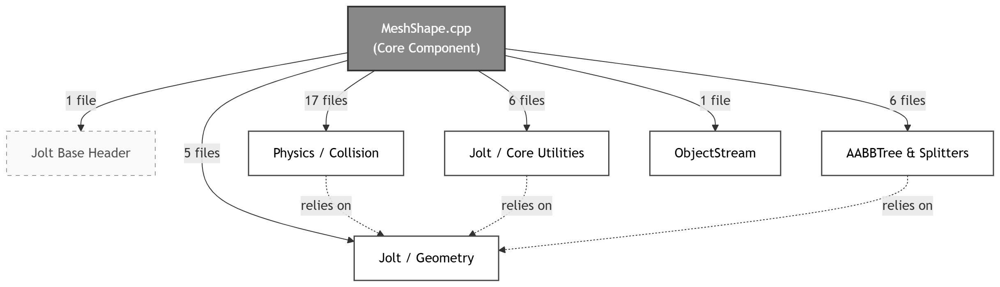
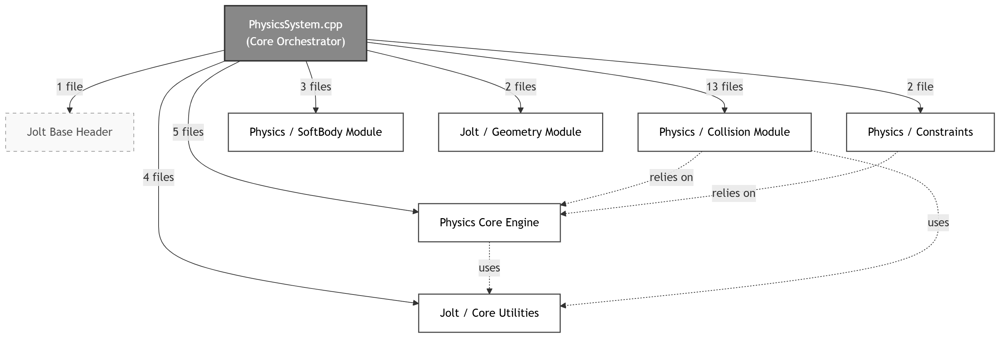
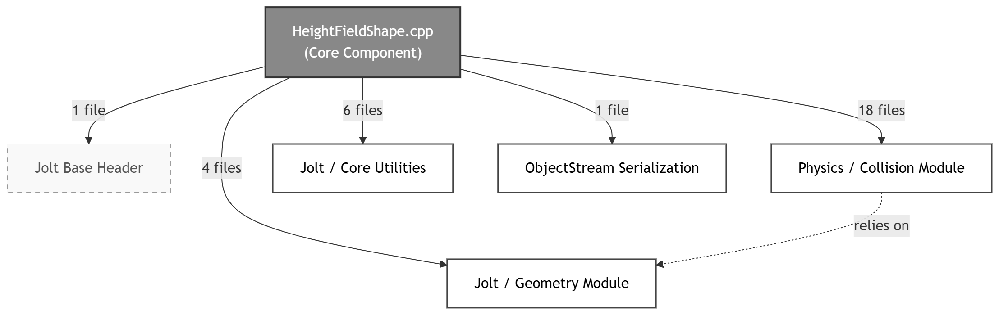
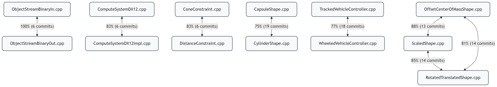

# Design

## 1. Dependencies Analysis

### 1.1 Methodology

To evaluate the dependencies among software modules within the core Jolt Physics library, we employed this approach:

1. **Code Dependencies (Static Analysis):** We utilized [Doxygen](https://www.doxygen.nl/) with [Graphviz](https://graphviz.org/) to parse the source code and extract structural dependencies. We configured Doxygen to recursively scan the directory and generate inclusion and inverse-inclusion graphs. This allowed us to map incoming and outgoing coupling visually.
2. **Knowledge Dependencies (Behavioral Analysis):** In order to quantify co-change frequencies (temporal coupling), we utilized [CodeScene](https://codescene.com/product/behavioral-code-analysis). By analyzing the Git commit history of the repository, we identified sets of files that are frequently modified together within the same commit. This approach allowed us to discover implicit logical or architectural coupling between modules that might not be visible through traditional static analysis.
3. **Automated cross-referencing:** To identify hidden dependencies, we developed custom Python [scripts](../analysis/dependencies/scripts/) to extract an `#include` matrix directly from the source code and mathematically intersect it with the temporal coupling dataset.

### 1.2 Code Dependencies Results 

#### Files with the most dependencies
The files exhibiting the highest number of outgoing dependencies are central implementation files that act as orchestrators or manage complex geometry and simulation logic:

* **`MeshShape.cpp` (36 dependencies):** This file handles complex mesh-based collision detection. Its high dependency count is justified by the need to interact with triangle intersection algorithms and various collision interfaces.

*Img1: MeshShape.cpp code dependencies (from Doxygen). [See more](../analysis/dependencies/images/mesh_shape_files.png)*

* **`PhysicsSystem.cpp` (30 dependencies):** This is the core orchestrator of the JoltPhysics engine. It coordinates bodies, constraints, shapes, and the simulation steps. Its high coupling is a natural consequence of its role as the central "hub" of the engine.

*Img2: PhysicsSystem.cpp code dependencies (from Doxygen). [See more](../analysis/dependencies/images/physics_system_files.png)*

* **`HeightFieldShape.cpp` (30 dependencies):** Similar to the mesh shape, this file manages terrain-like collision structures, requiring integration with multiple specialized math and collision utilities.

*Img3: HeightFieldShape.cpp code dependencies (from Doxygen). [See more](../analysis/dependencies/images/height_field_shape_files.png).*

#### Files with the least dependencies
By contrast, a large number of header files (`.h`) exhibit zero outgoing dependencies. They can be categorized into two main architectural groups:

* **Foundational Math & Utilities:** Files such as `Vector.h`, `Plane.h`, `Math.h`, `Color.h`, and `Memory.h`. 
* **Enums and Configuration:** Files such as `BodyType.h`, `MotionType.h`, and `PhysicsSettings.h`.

These files represent the lowest layer of the engine's architecture. They are designed with extreme cohesion and zero coupling to provide reusable building blocks. If a core utility like `Vector.h` were to include higher-level physics concepts, it would create circular dependencies, significantly damaging the modularity and maintainability of the engine.

#### High Afferent Coupling
While analyzing outgoing dependencies highlights the system's orchestrators, examining afferent coupling (incoming dependencies) reveals the fundamental pillars of the engine. Files such as `Body.h`, `Shape.h`, and the core abstract interfaces exhibit massive afferent coupling, as they are included by dozens of other modules across the codebase.
These components have a high degree of responsibility but must maintain a low degree of instability. Because so many other classes depend on them, any structural change to these header files will trigger a massive recompilation cascade and potentially introduce widespread breaking changes. Consequently, these core interfaces are maintained with extreme stability, heavily relying on polymorphism and abstract base classes to allow the rest of the engine to evolve without altering these foundational contracts.

### 1.3 Knowledge Dependencies

*Img4: Knowledge dependencies (from CodeScene)*

*Img5: Temporal coupling network graph showing co-change percentages and shared commits.*

#### Results and Inconsistencies
While several frequent co-changes were consistent with our static code dependencies, our [analysis](../analysis/dependencies/scripts/knowledge_deps.csv) revealed significant inconsistencies, cases where files change together structurally without a direct code link (`#include`).

* The most prominent example of this inconsistency is found in the serialization modules **`ObjectStreamBinaryIn.cpp`** and **`ObjectStreamBinaryOut.cpp`**. They show a temporal coupling around 100%.
	* These two files exhibit a perfect knowledge dependency, meaning developers always update them simultaneously. However, cross-referencing this with Doxygen analysis confirms zero code dependencies between them.
	* This inconsistency highlights an implicit dependency: the binary file format. If a developer modifies the engine to serialize a new physical property (e.g. in `Out`), they must logically mirror that exact change in the parsing sequence (`In`). The coupling is purely conceptual, driven by the need to maintain symmetric data handling.

* Another inconsistency was found among the geometric shape decorators and modifiers. Files such as `RotatedTranslatedShape.cpp`, `OffsetCenterOfMassShape.cpp`, and `ScaledShape.cpp` frequently co-change (showing an 85%-88% coupling).
While they do not include each other, they are logically coupled because they implement specific modifiers over the base Shape class. Whenever the underlying geometric API evolves all these concrete implementations must be updated in bulk to support the new feature. This is an example of  "Hidden Dependency" driven by the inheritance tree and polymorphic design.

### 1.4 Quantitative Analysis

To provide a comprehensive quantitative view, we applied Python [scripts](../analysis/dependencies/scripts/analyze_inconsistencies.py) to cross-reference the static analysis (1925 code dependencies) with the behavioral dataset. Out of the 171 highly coupled architectural pairs extracted from CodeScene, our script isolated [135](../analysis/dependencies/scripts/inconsistencies_found.csv) architectural inconsistencies:

1.  **High Code / High Knowledge:** Exactly 36 pairs (approx. 20%) of the highly co-changed modules fall here. These are tightly coupled subsystems where structural links (`#include`) properly document the need for simultaneous updates. *(Note: CodeScene inherently filters out trivial `.cpp`/`.h` couplings, keeping this number representative of true cross-module links).*
2.  **High Code / Low Knowledge:** Modules like core math headers exhibit massive afferent coupling (included across the 1925 static links) but zero temporal coupling, proving the foundation layers are extremely stable and decoupled from behavioral volatility.
3.  **Low Code / High Knowledge (The Inconsistencies):** The vast majority of our filtered dataset, 135 pairs (approx. 79%), represent hidden dependencies with no structural `#include` links. Beyond the serialization protocol mentioned above, our automated extraction highlighted examples of cross-platform parallel evolution (e.g., `RendererDX12.cpp` co-changing with `RendererMTL.mm`) and sibling-class synchronized updates (e.g., `ConeConstraint.cpp` and `DistanceConstraint.cpp`).

By analyzing this dataset, it is quantitatively clear that while the overall static architecture is clean, a massive portion of the engine's evolutionary dynamics relies on implicit knowledge, platform parity requirements, and polymorphic hierarchies that static analysis alone cannot map.

## 2. Patterns Analysis

### 2.1 Overview

The 4 design patterns that have been identified inside the Jolt system and are analysed in the following sections are: Singleton, Facade, Composite and Visitor. For each pattern a context is presented, then the list of classes involved in the pattern architecture is listed, followed by the reason(s) the patter is used and some closing considerations about pros and cons. 

### 2.2 Singleton

#### Context:
There are many examples of the Singleton pattern in the system, such as the Factory class, the Profiler class, the DeterminismLog class and DebugRenderer class, all needing to be accessed from a single point across different parts of the codebase.

#### Classes involved in c++ source code:
JPH::Factory, JPH::DebugRenderer, JPH::DeterminismLog, JPH::Profiler

// TODO: insert class diagram here (?)

#### Why is the pattern applied:
All the classes involved are accessed at multiple different points of the system, without any particular cohesion among those callers; this makes sense since functionalities such as debug drawing, profiling, logging and a way to instantiate objects with a given type id (the case of JPH::Factory) are very likely to be widespread in the codebase. This creates the need to ensure that a single point of access to these functionalities is provided, and the Singleton pattern is a simple and effective enough solution.

#### Considerations about pros/cons, possible alternatives:
One possible issue in the use of the Singleton pattern in the codebase is that it is implemented in a way that obstructs any future scalability of the functionalities currently encapsulated with it: let's consider for example the JPH::DebugRenderer class (but the considerations can apply to all Singleton occurrences in the system), where it is refactored to support more instances that run on multiple different threads to improve overall performance.
The problem lies in the static instance being accessed explicitly with the use of a public static variable "sInstance", not even a method "getInstance()" to wrap around it, so all DebugRenderer::sInstance calls need to be refactored (100+ occurrences across more than 20 files). It would be useful to add a layer of indirection with the use of a static method to access the instance, so that in a potential refactoring the method could internally switch from returning one instance to selecting the best among many instances available, essencially transitioning from a Singleton to a Broker without the need of drastic changes in the codebase. It has to be said that the Singleton are currently used to access features that are relatively stable and are likely to remain single instances throughout the system lifetime, so avoiding as little as one function call may be the preferred option in the context of high-performance computation. 

### 2.3 Facade

#### Context:
When using the engine to simulate physics and collisions between bodies, handle callbacks and perform queries against the scene, many different subsystems need to be called to interact with various aspect of the system, so a PhysicsSystem class is used as a Facade to redirect each external call to the appropriate subsystem operation. 

#### Classes involved in c++ source code:
JPH::PhysicsSystem (Facade), JPH::BodyManager, JPH::ContactConstraintManager, JPH::ConstraintManager, JPH::BroadPhase, JPH::NarrowPhaseQuery, JPH::BodyInterface, JPH::PhysicsStepListener... (Subsystems)

// TODO: insert class diagram here

#### Why is the pattern applied:
The pattern is used because having a single access point to different etherogeneus features can provide very useful in the context of game engines or other applications that need to interact with the physics engine code without having to know much about the underlying architecture, especially considering that this enables less coupling between the business rules and the physics engine implementation, given that the PhysicsSystem provides a stable enough boundary.
The PhysicsSystem facade also serves the purpose of initializing many of the subsystem itself, like BroadPhase, ConstraintManager, BodyInterface and others. it also offers some methods to orchestrate more complex behaviours that involve various subsystems, such as the "Update" method: it is responsible for the physics simulation step and it involves the BroadPhase, BodyManager, Contacts Manager and others.

#### Considerations about pros/cons, possible alternatives:
No other patterns are really suitable alternatives of the facade in the context of providing a single interface for multiple subsystem to access their functionality, when these are provided by defined systems that do not change at execution time.

### 2.4 Composite

#### Context:
The physics engine is able to simulate bodies that resemble different objects by using a variety of "shapes", such as Sphere, Box, Capsule, Plane... More complex objects (like humanoid characters, vehicles, or even large scenaries made up of many different parts) however are hardly reprisented by only one of such shapes, so a special shape is defined to handle the conjunction of other child shapes. 

#### Classes involved in c++ source code:
JPH::Shape, JPH::CompoundShape, JPH::StaticCompoundShape, JPH::MutableCompoundShape (the last 2 are subclasses of CompoundShape: they are not directly involved in the pattern but are the only 2 concrete classes in the list)

// TODO: insert class diagram here

#### Why is the pattern applied:
Since a lot of operations that involve aggregate ("composite" in the pattern name, "compound" in the codebase) shapes can be reconduced to a combination of operations on the shapes in the aggregation, the Composite pattern provides a useful way of hiding this complexity from the caller of those operations. Such operations are then handled transparently by combining the information of sub shapes (with the use of the visitor pattern) and returning the appropriate result.

#### Considerations about pros/cons, possible alternatives:
Differently than the standard implementation presented in literature, the CompoundShape doesn't directly provide the method to remove a child (RemoveShape). This is due to the fact that one of its subclasses is the StaticCompoundShape, where the shape is "static" in the sense that it cannot be altered after its creation. The RemoveShape method is in fact provided and implemented in the other subclass, which is MutableCompoundShape.

### 2.5 Visitor

#### Context:
The physics engine is able to simulate bodies that resemble different objects by using a variety of "shapes", such as Sphere, Box, Capsule, Plane... More complex objects (like humanoid characters, vehicles, or even large scenaries made up of many different parts) however are hardly reprisented by only one of such shapes, so a special shape is defined to handle the conjunction of other child shapes. 

#### Classes involved in c++ source code:
JPH::QuadTree, JPH::QuadTree::NodeID, JPH:BodyID, JPH:QuadTree:Node

> Note:   
> there are other occurrences of the visitor pattern being used along with CompoundShape subclasses, but they were not the ones analysed as the CompoundShape is already of interest in the use of the Composite pattern.

There are no close resemblances to the design patter just by looking at the classes involved (see considerations below), but in a fully-OOP setting the classes roles would look like this: 

QuadTreeElement is the abstract "Element" with 2 concrete implementations:
- Nodes (a group of 4 TreeElements)
- Body (a leaf of the Tree)

Visitor is the abstract "Visitor" with many concrete implementations:
- CastRayVisitor
- CastAABoxVisitor
- CollideAABoxVisitor
- CollideSphereVisitor
- CollidePointVisitor
- CollideOrientedBoxVisitor

#### Why is the pattern applied:
In this case the Element interface only has 2 concrete implementations, however there are multiple operations that need to be performed, with more that may be introduced at any point in the project developement to add functionalities such as new physics queries: it would clutter the tree traversal function to have all those different etherogeneus behaviours inside one method, with the rapid degradation of maintainability. By using the visitor pattern each different query is segregated inside its own visitor, while the tree traversal code stays untouched.

#### Considerations about pros/cons, possible alternatives:
In this case, the Element hierarchy is not actually defined because there are only 2 Element types that will ever need to exist and the tree traversal doesn't happen recursively but with a stack-like data structure because of performance reasons. Also the Visitor interface is missing and that is because all the queries are c++ template functions with a custom visitor defined and implemented inside, with compiler directives to make all the method calls inlined, so actually no visitor will exist at all after the compilation step. This makes sense since physics queries are likely to be called hundreds or thousands of times per seconds, but this comes at the cost of worse understandability of this section of the code. 

## 3. Summary

In conclusion, the dependency analysis reveals that JoltPhysics is a highly modular engine with a well-defined layered architecture. Code dependencies properly flow towards highly cohesive, independent mathematical foundations. However, our behavioral analysis proves that developers must remain aware of implicit knowledge dependencies, because structural decoupling does not prevent logical coupling.

// TODO: patterns summary