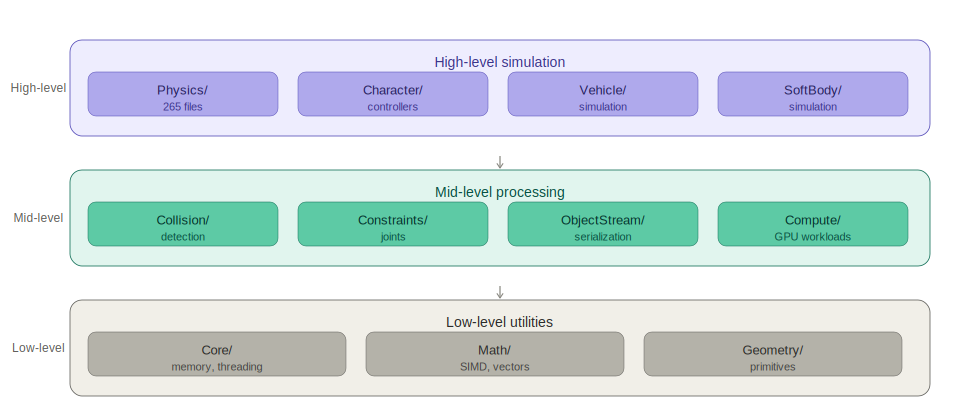

# Overview

## 1. Introduction

Jolt Physics is an open-source, real-time rigid body physics engine written in C++. It was created by Jorrit Rouwe as a personal learning project, with the goal of solving specific problems he had with existing physics engines, mainly around multi-threaded access to simulation data. The project was made publicly available on GitHub in 2022 and has been actively developed since then by a growing open-source community.

The engine is designed for video games and real-time interactive simulations. It is not intended for scientific simulation and does not aim for physically exact accuracy. Instead, the focus is on stable, fast, and deterministic simulation that works reliably in production game environments. It is distributed under the MIT license, which allows both commercial and open-source projects to use it freely without any licensing restrictions.

## 2. Stakeholders

Jolt Physics is used by a diverse range of stakeholders, including commercial game studios, open-source engine teams, and independent developers.

The most prominent commercial users are Guerrilla Games, which used Jolt in *Horizon Forbidden West*, and Kojima Productions, which used it in *Death Stranding 2*. Beyond AAA studios, a large number of open-source engines have also adopted Jolt, including Godot (since v4.4), Wicked Engine, and ezEngine, with many projects listed among its known adopters. 

The MIT license is one of the reasons why the engine has been adopted by so many projects, since teams can use and integrate it without licensing restrictions. The project also has community maintained bindings for C, C#, JavaScript, Rust, Python, Java, and Zig, which extends its reach well beyond C++ developers.

Three broad stakeholder groups can be identified, each with different requirements:

- **Commercial game studios** need deterministic, high-performance simulation. Correctness and throughput are non-negotiable for these teams.
- **Engine teams and open-source integrators** require API stability and clean integration boundaries to minimize maintenance effort.
- **Independent developers and smaller teams** require accessible documentation and a straightforward integration process.

The adoption of Jolt in multiplayer titles such as War Thunder and X4 Foundations highlights the importance of deterministic simulation. In multiplayer environments, physics simulations must produce consistent results across different machines to keep game state synchronized. This helps explain why determinism is treated as a core design goal throughout the project.

## 3. Purpose and Features

The main purpose of Jolt Physics is to simulate physical behaviour such as object movement, collisions, and interactions while remaining fast and stable enough for real-time use. 

The engine supports a wide range of features, including rigid body simulation, collision detection, constraints, character controllers, vehicles, soft bodies, and GPU-based hair simulation. The engine is therefore designed to handle much more than basic game physics and covers a wide range of real-time simulation needs.

Performance is a major focus of the project. The engine is designed to handle large and complex scenes efficiently, making it suitable for modern games.

Jolt Physics also supports multiple platforms, including Windows, Linux, macOS, iOS, Android, and WebAssembly. This makes it suitable for different types of projects, ranging from commercial games to open-source game engines.

## 4. Codebase Statistics

To understand the size and composition of the project, code statistics were collected from the Jolt Physics repository using the cloc v2.08 tool. The project has attracted contributions from 84 developers and has maintained an active development history with 1,655 commits across 15 releases.

### Project Metadata

| Metric | Value |
|---------|---------|
| Contributors | 84 |
| Primary Maintainer | Jorrit Rouwe (jrouwe) |
| License | MIT |
| Latest Release | v5.5.0 (December 2025) |
| Total Commits | 1,655 |
| GitHub Stars | 10.4k |
| GitHub Forks | 713 |

### Codebase Metrics

| Metric | Value |
|---------|---------|
| Total Files | 1,195 |
| Source Lines of Code (SLOC) | 138,100 |
| Blank Lines | 32,768 |
| Comment Lines | 28,511 |

### Language Breakdown

| Language     | Files     | Blank      | Comment    | Code        |
|--------------|-----------|------------|------------|-------------|
| C++          | 441       | 17,802     | 12,442     | 85,603      |
| C/C++ Header | 619       | 13,287     | 15,288     | 43,717      |
| CMake        | 11        | 212        | 257        | 2,012       |
| Objective-C++| 16        | 273        | 104        | 1,045       |
| HLSL         | 28        | 198        | 179        | 804         |
| GLSL         | 11        | 63         | 25         | 202         |
| Metal        | 4         | 59         | 27         | 223         |
| Markdown     | 10        | 644        | 0          | 1,686       |
| Bourne Shell | 10        | 53         | 118        | 192         |
| DOS Batch    | 21        | 21         | 2          | 178         |
| Python       | 1         | 19         | 24         | 100         |
| Other        | 23        | 136        | 45         | 338         |
| **Total**    | **1,195** | **32,768** | **28,511** | **138,100** |

The codebase is written primarily in C++, with C++ source and header files accounting for approximately 94% of all code. This matches the project's focus on performance and the low-level control that C++ provides.

The remaining files consist primarily of build scripts, documentation, platform-specific code, and GPU shader programs. The presence of Objective-C++ files confirms support for Apple platforms, while HLSL, GLSL, and Metal files indicate support for GPU-based workloads across multiple graphics APIs. The repository also contains a CMake-based build system, which enables cross-platform compilation and deployment across all supported targets.

## 5. Module Structure

The core implementation of Jolt Physics is located in the `Jolt/` directory, which is divided into 11 top-level modules. Each module focuses on a specific area of the engine, making the codebase easier to understand and maintain.

| Module             | Files | Role                         |
|--------------------|------:|------------------------------|
| Physics/           | 265   | Main simulation pipeline     |
| Core/              | 68    | Memory, threading, utilities |
| Compute/           | 46    | GPU compute workloads        |
| Geometry/          | 27    | Geometric primitives         |
| Math/              | 25    | Math types and operations    |
| ObjectStream/      | 23    | Serialization                |
| Renderer/          | 8     | Debug visualization          |
| Skeleton/          | 8     | Skeletal animation support   |
| AABBTree/          | 5     | Bounding volume hierarchy    |
| TriangleSplitter/  | 6     | Mesh processing              |
| Other              | 19    | Platform and miscellaneous   |
| **Total**          | **513** |                            |

*Fig 1: Layered organization of the Jolt/ core library modules.*

The largest module is `Physics/`, which contains most of the simulation logic, including collision detection, constraints, character controllers, vehicle systems, and soft body simulation. With 265 files, it accounts for more than half of the core library.

Several smaller modules provide supporting functionality. `Core/` contains utilities related to memory management and threading, while `Math/` and `Geometry/` provide the mathematical and geometric functionality used throughout the engine. Other modules such as `ObjectStream/`, `Skeleton/`, `Renderer/`, and `Compute/` provide serialization, animation support, debugging tools, and GPU-related features.

Overall, the structure follows a clear layered organization. Smaller utility modules provide the foundation of the engine, while most of the physics-specific functionality is implemented in the larger Physics/ module. This makes the structure easier to navigate and helps keep related functionality grouped together.
